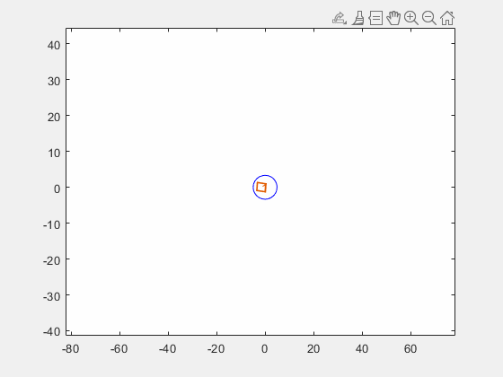

# track-vehicles-lidar
Create tracks for LiDAR bounding boxes 
Detection is using PV-RCNN

Association is via Munkres using GIOU metric
Tracking is using KF 

We write to DB and then plot from DB

Run `create_tracks_from_detections.m` to create tracks from detections

Then run `readDBPlotTracks.m` to plot the tracks against the detections

Tracking result - 
